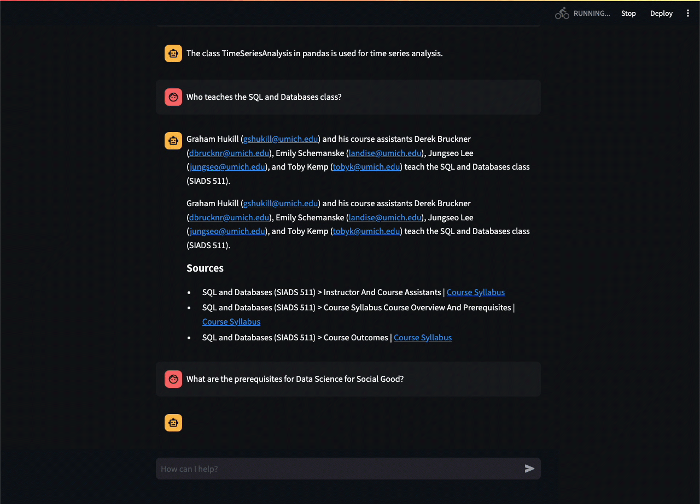

# MADS-RAG: A Helpful Chatbot for Master’s of Applied Data Science Students at the University of Michigan

### SIADS 699 Capstone (Winter 2024)

Team 28: Patrick Sollars (psollars@umich.edu), Aaron Newman (newmanar@umich.edu), and Tawfiq Zureiq (tawfiqz@umich.edu)

## Overview

MADS-RAG is developed to enhance the remote learning experience for MADS students, providing quick and accurate answers to queries about course schedules, policies, and content. MADS-RAG leverages a Retrieval-Augmented Generation (RAG) pipeline, integrating the latest course and program information dynamically.

- **Dynamic Content Retrieval:** Pulls in the most relevant and up-to-date information from various sources like course syllabi, handbooks, and transcripts.
- **Familiar Interface:** Easy to use interface built with Streamlit for an intuitive user experience.
- **No External APIs:** Runs locally (with a powerful computer), ensuring data privacy and cost efficiency.


_High-level architecture of the MADS-RAG chatbot_

## Quickstart

With all dependencies, models, and source data installed, the chatbot can be started by:

1. navigating to the chatbot directory: `cd 04_chatbot`
2. start the chatbot client: `pipenv run streamlit run ./chatbot.py --server.port 8501`
   - If your machine can't handle it, you can use `mock_chatbot.py` which uses cached responses with minimal resources (Not the RAG LLM)
3. Navigate to http://localhost:8501 where you can:
   - Enter your prompt
   - View the response generated from the MADS-RAG pipeline
   - Interact with links in the response or source information

### Run with llama_cpp

llama.cpp can be configured to run with hardware acceleration for your particular machine. See the [documentation](https://github.com/abetlen/llama-cpp-python?tab=readme-ov-file#installation-configuration) for more information on installation configuration for this package.

```sh
cd 04_chatbot

pipenv run python -m llama_cpp.server —config_file llama_cpp_config.json

# In a new shell...
pipenv run streamlit run ./chatbot_llama_cpp.py --server.port 8501
```


_MADS-RAG chatbot interface using Streamlit_

## Using This Repo

### `01_loading`

This contains relevant code to load and split the documents. Sources were later pulled from the MADS program website and other public sources and were parsed using Marker. Some of these files were manually cleaned, so the steps weren't documented in this code. The output of all document collection is in the `documents` directory at the root of this repo.

### `02_evaluation`

Many notebooks used here to test out different retrieval strategies and models. The notebooks have some report or visualization at the end about the performance of that particular configuration. Selected components for the final chatbot highlighted in **bold**.

- Retrievers
  - ChromaDB (mmr, similarity_score, similarity_score_threshold)
  - TF/IDF
  - BM25
  - Ensemble (chroma, tfidf, bm25)
  - **ColBERT**
- Models
  - Llama2 (7B & 13B)
  - **Mistral7B**
  - Starling7B
- Evaluation Strategies
  - BERTScore
  - BLEU
  - ROUGE
  - METEOR
  - Ragas
  - **Just using our eyes** `¯\_(ツ)_/¯`

### `03_visualization`

Document chunking analysis and topic modeling visualizations for the report.

### `04_chatbot`

Notebooks, scripts, and configuration relevant to the UI or “productionizing” the finished product.

### `colbert_index`

This is the primary retrieval index. Only "documents" are stored in this repo. See [Data Access](#data-access) for details on proprietary transcript data in the [capstone-protected](https://github.com/psollars/capstone-protected) repo.

### `colbertv2.0`

Clone the [colbertv2.0](https://huggingface.co/colbert-ir/colbertv2.0) model into the root of this project. This requires [git lfs](https://git-lfs.com/) to be installed and configured on your machine.

### `documents`

These are the raw source files in plain text markdown format. They can be fed to our embedding notebooks to create document indexes.

### `embeddings`

This directory contains chunked documents and metadata after the initial loading with ChromaDB. Many evaluation notebooks will reference these cached embeddings, but the final chatbot uses ColBERT as the retriever.

### `models`

Various quantized models were tested for this project. These are very large files that can be downloaded directly from Hugging Face.

- https://huggingface.co/TheBloke/Llama-2-7B-GGUF
- https://huggingface.co/TheBloke/Mistral-7B-Instruct-v0.2-GGUF
- https://huggingface.co/TheBloke/Starling-LM-7B-alpha-GGUF

## Environment

### pipenv

This repo uses [pipenv](https://pipenv.pypa.io/en/latest/) to manage dependencies. If you don't already have it installed you can do so with:

```sh
$ pip install --user pipenv
# -or-
$ brew install pipenv
```

Or, view the complete [installation documentation](https://pipenv.pypa.io/en/latest/installation.html). Then navigate to the repo and run these commands to install project dependencies.

```sh
# Recommended to keep the venv local to the repository
export PIPENV_VENV_IN_PROJECT=1

pipenv shell

pipenv install --dev
```

> **NOTE:** You might also prefer to set `PIPENV_VENV_IN_PROJECT=1` in your .env or .bashrc/.zshrc (or other shell configuration file) for creating the virtualenv inside your project’s directory.

### Secrets

Some notebooks require API keys to run, these should be stored in the .gitignored file, `secrets.py`, in the root of this repo.

```sh
OPENAI_API_KEY = "your_secret_key" # only for evaluation
NGROK_AUTH_TOKEN = "your_secret_key"
```

## Data Access

All syllabus documents used in this project are publicly accessible through the [Master of Applied Data Science Curriculum page](https://www.si.umich.edu/programs/master-applied-data-science/curriculum/mads-courses).

Additional source documents are referenced below:

- [MADS Student Handbook](https://docs.google.com/document/d/1YEOcpdONdme5kmpNEnZpdbJeVFhEIw1pS0wq16QdH1I/edit)
- [MADS Academic Advising FAQ](https://docs.google.com/document/d/1A3zdTF0AYQY_zzD2-OlpSHeDxnWqFVEhXl446SyT_pA/edit)

Proprietary transcripts from MADS course lectures were pulled from Coursera using [`coursera-dl`](https://github.com/coursera-dl/coursera-dl). These exist in a [private repo](https://github.com/psollars/capstone-protected) at the following paths. This project references data at these paths which will need to be manually copied from the private repo.

- `colbert_index/colbert/indexes/combined`
- `colbert_index/colbert/indexes/transcripts`
- `documents/transcripts`
- `embeddings/transcripts.pickle`

> Access to these transcripts is restricted to the Winter 2024 Capstone course students and instructors. If you would like access to this repo, please reach out to [psollars@umich.edu](mailto:psollars@umich.edu) with your request.

Quantized large language models were sourced from public HuggingFace repositories:

- https://huggingface.co/TheBloke/Llama-2-7B-GGUF
- https://huggingface.co/TheBloke/Mistral-7B-Instruct-v0.2-GGUF
- https://huggingface.co/TheBloke/Starling-LM-7B-alpha-GGUF
- https://huggingface.co/colbert-ir/colbertv2.0
